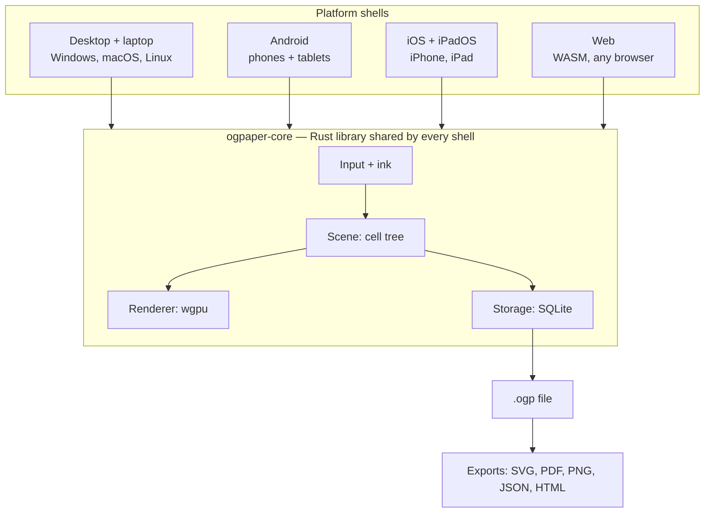

# OG Paper — Design Spec

Living version (with comments): https://claude.ai/code/artifact/8f7a907a-ec10-49dd-9fb0-4375907abd52
This file is the in-repo snapshot. Last synced 2026-09-26; status, the implemented file formats and the to-do list updated 2026-10-01.

## Summary

Build an open-source infinite canvas that runs on every desktop, laptop, phone and tablet — Windows, macOS, Linux, Android, iOS/iPadOS and the web — and whose files outlive the app: every canvas is a documented, plain-format file a user can open with standard tools even if the project dies.

**What "endless" means here:** unbounded pan in 2D and unbounded zoom depth (not just 0.1x–10x). A user can write a sentence inside the dot of an "i" and zoom out until a whole notebook is a speck. The renderer only draws what is inside the viewport *and* big enough on screen to matter.

**Core promises:**

- **Files you own.** Local-first; no account needed; no server required to read your work.
- **Format outlives the app.** Open spec, versioned, SQLite + plain JSON/SVG export; any future tool can read it.
- **Runs everywhere.** One engine on six targets; the same file opens identically on a Windows laptop, an Android phone and an iPad.
- **Snappy on every supported device.** 2024 flagship phones are the performance bar; older devices are best-effort. Ink latency < 20 ms on native stylus hardware; 60 fps pan/zoom minimum, 120 Hz where the screen supports it.

**Non-goals for v1:** real-time multi-user collaboration, AI features, handwriting OCR, a project-hosted sync service.

## Where it stands (2026-10-01)

Phase 0 is done ([`PHASE0.md`](PHASE0.md)); Phase 1 milestone M1 is done, plus several features planned for later phases ([`PHASE1.md`](PHASE1.md)).

| Area | Working today |
| --- | --- |
| Platforms | Windows, macOS, Linux, Android (APK) and the web (WASM, WebGPU or WebGL2, installable PWA), built by CI on every push |
| Ink | Pen (pressure), marker, highlighter; solid / dashed / dotted strokes; opacity; stroke eraser; eyedropper; color dial + custom colors; width per brush; undo/redo (Ctrl+Z / two-finger tap, Ctrl+Y / three-finger tap) |
| Shapes | One Shapes tool: rectangle, ellipse, diamond, triangle, star, polygon, line, arrow. Excalidraw-style options: fill (none, hachure, cross-hatch, zigzag, solid) and fill color, stroke width and style, sloppiness (architect, artist, cartoonist), sharp / round edges, star points / polygon sides, line type (straight, curved, elbow), arrowheads at either end, opacity. Shift keeps proportions / snaps angles, Alt draws from the centre |
| Text | Text tool with 11 bundled outline fonts (Architects Daughter, Patrick Hand, Indie Flower, Permanent Marker, Nunito, Comic Neue, Lora, JetBrains Mono, Courier Prime, Bangers, Pacifico; SIL OFL / Apache 2.0, credits in `web/app/fonts/README.md`), three single-stroke fonts (Single-line, Single-line hand, Single-line mono), and your own TTF / OTF fonts ("Add your own font…": kept in the browser's IndexedDB on the web, in `~/OG Paper/fonts` on desktop); sizes, alignment, color and opacity; multi-line; double-tap a text with Select to edit it. Text is ink, so it stays sharp at any zoom |
| Select and edit | Tap or box-select; Shift-click to add; move, resize (corner handles, Shift keeps proportions, Alt from the centre), rotate (knob above the box, Shift snaps to 15°); duplicate, delete, bring to front, send to back, flip; restyle a selection from the tool panel; copy / paste; arrow keys nudge. All edits are one undo step each |
| Canvas | Unbounded pan and zoom (tested past 10^45 in the app, 10^48 in the spike); content of any size at any depth |
| Files | Desktop and Android: autosave to `.ogp` (SQLite), New / Open / Save As. Web: autosave in browser storage, download / open `.ogpt` offline copies |
| Bookmarks (web) | Save the current view; rename, delete; tap to fly there (animated zoom + pan across any depth, framed for the screen size) |
| Timeline (web) | Every stroke appearing or disappearing is time-stamped; scrub or play back the canvas at any past moment; "Restore" makes that moment current (undoable) |
| Try mode (web) | `/try/` opens the app on a demo canvas: 15 worlds nested 1024x each inside dots, down to 10^45, plus a guided checklist |

**Controls.** All controls are round buttons drawn by the app (egui), sized for touch on touch screens:

- **Tool button** (bottom right) fans out the tools in quarter-circle rings: pen, marker, highlighter and eraser on the inner ring; select, shapes, text, picker and pan on the outer one. Fans fill rings from the inside out, so a longer menu adds a ring instead of one huge curve (the ⚙ fan does the same).
- **Tool panel** (top left, like Excalidraw's properties panel) shows the current tool's settings, or the selection's, and stays out while you draw. Pens: stroke preview, width, pressure (pen), stroke style, opacity and the color dial (preset rings around the current color, a hue ring, an eyedropper, saturation / brightness bars). Shapes: shape picker and all the shape options above, with the dial switching between stroke and fill color. Text: font picker (each name drawn in its own font, grouped by category, plus "Add your own font…"), size, alignment, opacity, color. Select: actions (duplicate, delete, front, back, flip, edit text) and the style of what is selected; changes apply when the pointer is released. Its chevron tucks it into a small sliders button that pops it back out; it starts open on wide screens and tucked on phones. New per-tool options (textures, presets) will be added as sections here.
- **Keyboard:** 1 / 2 / 3 pen / marker / highlighter, E eraser, I picker, H pan, V select, S shapes, R / O / D / A / L rectangle / ellipse / diamond / arrow / line, T text; with a selection: Delete, Ctrl+D duplicate, Ctrl+C / Ctrl+V copy / paste, Ctrl+] / Ctrl+[ front / back, arrows nudge (Shift: 10 px), Esc deselect; Ctrl+A selects everything on screen.
- **Undo / redo** (left of the tool button): ↩ and ↪.
- **Settings button ⚙** (top right) fans out the canvas commands: New canvas, Open, Save copy, Home, and on the web Bookmarks, Timeline, Full screen and (try mode) Tour. The zoom depth is shown under it. The web page tells the app which items it offers and draws the panels (bookmark list, timeline bar, tour) as HTML.

## Endless Paper teardown

[Endless Paper](https://www.endlesspaper.app/) is an iPad-only, closed-source vector canvas from Epiphanie, built on a custom engine called **Fractile**; its only escape hatches are lossy exports (PNG, PDF, video, web page). There is no documented native file format, so a canvas cannot be re-opened anywhere else.

**Published features** ([App Store](https://apps.apple.com/us/app/endless-paper/id1294105620)):

| Area | What they ship |
| --- | --- |
| Canvas | Infinite pan + zoom; vector at any zoom; 120 fps "even with millions of strokes"; bookmarks |
| Ink | Apple Pencil pens, eraser modes, bucket fill, unlimited undo/redo |
| Organization | Up to 4 layers; lasso to move/resize/duplicate; multi-canvas gallery |
| Import | Images (drag-drop), PDF import + annotate, image vectorization |
| Export | Hi-res image, vector PDF, 8K zoom-animation video, "Web Experience" interactive site |
| Storage | Autosave with versioning/archiving; no open format documented |
| Platform | iPadOS 16+ only |
| Price | Free base; Premium $5.99/mo or $29.99/yr; Pro $99.99/yr |

**How the engine likely works (inferred, not published):** "Fractile" suggests fractal tiles — a quadtree where each level is a tile at 2× the zoom of its parent, strokes stored in tile-local coordinates. That is the standard way to beat float precision at deep zoom, and it matches their 2.1.6 note "improved stability for deeply zoomed canvases".

**Lock-in risks for users:** undocumented binary blob in the app sandbox; flattening exports; subscription-gated, iPad-only, one small company; if the app is pulled, a device wipe loses the ability to open the data.

**Open-source neighbors:** [Rnote](https://rnote.flxzt.net/) (Rust, stylus, bounded zoom, app-specific format), [Xournal++](https://xournalpp.github.io/) (page-based), [tldraw](https://tldraw.dev/) and [Excalidraw](https://excalidraw.com/) (web whiteboards, no deep zoom), Eagle Mode (infinite-zoom UI, not a notes app). None combine stylus-grade ink on every OS, unbounded zoom depth, and a durable open format — that gap is the project.

## Core architecture

One Rust core owns the scene, renderer and storage; each platform is a thin shell. Infinite zoom is solved with nested cells and exact integer cell addresses, not bigger floats.



### Why plain floats break

An f32 holds about 7 significant digits and an f64 about 16. A canvas with a zoom range past 10^7 jitters in f32; past 10^15 it jitters in f64. "Truly endless" needs coordinates with no global precision limit.

### Coordinate model: nested cells

- **World = sparse quadtree of cells.** A cell at level L has side 2^-L world units. L is any integer, unbounded both ways.
- **Cell address = (L, i, j)** with integer i, j. i64 while it fits; big integers past about 60 levels from the origin. Only cells that hold content exist.
- **Every object anchors to one cell:** the cell at the level where the object spans about 1/4 to 1 cell side. Its points are f32 in cell-local space [0, 1].
- **Camera = (cell, local offset, scale s in [1, 2))**. Zooming past 2× re-anchors the camera to a child or parent cell, so it never accumulates precision error.

Screen position of local point **p** in cell (L, **c**), camera in cell (Lc, **c_cam**) at offset **o_cam**:

```
x_screen = s · W · ( 2^(Lc − L) · (c + p) − c_cam − o_cam )
```

W is pixels per camera cell. The integer part, 2^(Lc−L) · c − c_cam, is computed exactly in integers first; it is small for anything on screen, so only a small number is converted to f64.

### What gets drawn each frame

1. Start at the camera cell. Walk up a few ancestor levels and down into descendants.
2. Cull any cell whose screen rectangle misses the viewport.
3. Stop descending when a cell is under about 1 px on screen; its content is never loaded.
4. Cells between about 1 and 256 px on screen draw a cached raster thumbnail (mip tile).
5. Larger cells draw vector meshes, tessellated once per LOD bucket and cached on the GPU. Huge ancestor strokes are clipped to the viewport.

Frame cost is O(visible), not O(canvas size). Cells load lazily from SQLite by address into an LRU cache.

### Ink pipeline

1. Pen events arrive batched + predicted from each OS: UIKit coalesced/predicted touches (iOS), MotionEvent history + front-buffered rendering (Android), Windows Ink, libinput tablet (Linux), NSEvent tablet (macOS), Pointer Events getCoalescedEvents/getPredictedEvents (web).
2. A 1€ filter smooths the path; pressure and tilt map to width and opacity.
3. Wet ink draws in a separate overlay at display refresh.
4. On pen-up, the stroke is fitted to a variable-width polyline, anchored to its cell, and committed as one op.

Stroke width is stored in cell-local units, so a note written at deep zoom stays proportionally tiny when zoomed out.

**Reference device and pen testing:** a Galaxy S24 is the reference phone and first Android test device. No stylus hardware yet, so pressure, tilt and prediction are built against recorded stroke traces replayed in tests; mouse and finger drive day-to-day development with simulated pressure; community testers tune real styluses.

### Fast on every device

| Tier | Example devices | Frame target | GPU cache | Quality |
| --- | --- | --- | --- | --- |
| High | iPad Pro, M-series Mac, discrete-GPU desktop | 120 fps+ | 512 MB+ | Vectors down to 128 px cells, 4× MSAA |
| Baseline (the bar) | 2024 flagship phones, iGPU laptops, recent tablets | 120 fps on 120 Hz, never below 60 | 256 MB | Thumbnails from 256 px down, 4× MSAA |
| Best-effort | Older/budget phones, Chromebooks, WebGL2-only | 60 fps aim | 128 MB | Thumbnails from 512 px down, shader AA |

Design targets to verify in Phase 0, not measured numbers.

1. **Ink never waits** — own overlay/front buffer, independent of scene, disk, sync.
2. **Render only on change** — no idle redraw loop.
3. **Frame governor** — over budget → raise thumbnail threshold; never drop input.
4. **Heavy work off the UI thread** — rayon natively, Web Workers in WASM.
5. **Fast gestures move pixels, not vectors** — re-tessellate after the gesture settles.
6. **Incremental saves** — one stroke = one SQLite insert in a WAL transaction.
7. **Instant open** — meta + cells near the last camera first, stream the rest.
8. **Hard memory caps** — tier-sized LRU; evict on OS low-memory warnings.
9. **Performance tests in CI** — 1M-stroke canvas, scripted zoom path, every target.

**Input by form factor:** stylus = draw, finger = pan/zoom on touch devices (palm rejection, optional finger-draw); wheel/pinch/space-drag and shortcuts on desktop. Controls are the same radial fans on every form factor (see *Where it stands*), with bigger targets on touch screens.

## Data model and file format

A canvas is one `.ogp` file: a SQLite database with a published, openly licensed schema. SQLite is a [Library of Congress recommended storage format](https://www.sqlite.org/locrsf.html) and its developers [intend to support it through 2050](https://www.sqlite.org/lts.html).

### Schema (v1 draft)

| Table | Key columns | Holds |
| --- | --- | --- |
| `meta` | key, value | `format_version`, `created`, `app_version`, plus a `README` row describing the format and the spec URL |
| `cells` | level, ix, iy | Cell address (ints as decimal text), bounding box, object count, cached thumbnail PNG |
| `objects` | id (UUIDv7) | Anchor cell, kind (`stroke`, `image`, `text`, `shape`, `pdf_page`), layer, z-order, transform, payload, timestamps, tombstone |
| `layers` | id | Name, order, visibility, lock |
| `bookmarks` | id | Name + camera (cell, offset, scale) |
| `blobs` | sha256 | Original image/PDF bytes + MIME type |
| `ops` | seq | Append-only edit log (JSON), each op stamped with a hybrid logical clock + device id |

**Stroke payload:** little-endian binary — header (point count, brush id, color RGBA, base width), then per point: x, y (u16, cell-local), pressure (u8), tilt (u8). About 6 bytes/point.

### Longevity guarantees

1. **Open spec, versioned** (CC BY 4.0). Minor versions only add; readers ignore unknown columns and kinds.
2. **Never drop unknown data** — older apps preserve newer object kinds untouched.
3. **Self-describing file** — the `meta.README` row explains the format.
4. **Stdlib-only reference reader** — `ogpaper-dump.py` (Python `sqlite3` + `struct`) turns any file into SVG + JSON.
5. **Plain-folder export** — `canvas.json`, one SVG per cell, original images.
6. **Self-contained HTML export** — one offline `.html` with the WASM viewer and data inlined.
7. **Standard flat exports** — SVG, vector PDF, PNG; zoom-path video later.
8. **Your storage, your sync** — files live wherever the user puts them; sync never needs a project server.

**Migrating off Endless Paper:** their vector PDF export → our PDF import. Depth and layers will not survive.

### Implemented today: `.ogp` format 0.2

The v1 schema above is the target. What the app writes now (`crates/ogpaper-file`, `meta.format_version = "0.2"`) is a subset. 0.2 only adds to 0.1: 0.1 files open and are upgraded in place (new columns and table), and 0.1 readers can still read 0.2 files (they ignore what they do not know).

| Table | Columns | Notes |
| --- | --- | --- |
| `meta` | `key` TEXT PK, `value` TEXT | Keys: `format` = `ogp`, `format_version` = `0.2`, `README` (plain-English description of the format), `created` (Unix ms), `app` (`og-paper <version>`), `view` (last camera, see below) |
| `objects` | `id` BLOB PK (UUIDv7, 16 bytes big-endian), `level` INTEGER, `ix` TEXT, `iy` TEXT, `kind` TEXT, `brush` INTEGER, `color` INTEGER, `width` REAL, `points` BLOB, `deleted` INTEGER, `created` INTEGER, *0.2:* `dash` INTEGER, `z` REAL | Index `objects_cell (level, ix, iy)`. Only `kind = 'stroke'` so far |
| `groups` *(0.2)* | `id` BLOB PK, `level` INTEGER, `ix` TEXT, `iy` TEXT, `kind` TEXT (`shape` / `text`), `data` BLOB, `strokes` BLOB, `created` INTEGER | Shapes and texts: the strokes they were drawn as, and the settings to edit them again |

- **Cell address:** `level` plus `ix`, `iy` as decimal text (arbitrarily large integers).
- **Stroke points:** little-endian f32 triples (x, y, pressure) in the anchor cell's local space, where [0,1]² is the cell. Strokes may overflow their cell by up to one cell side. In a fill stroke (brush 3), pressure -1 marks a *bridge* point: the edge into it joins two contours of one letter, counts for the fill's winding but is never drawn.
- **`width`:** in the same cell-local units. **`color`:** RGBA8 packed R | G<<8 | B<<16 | A<<24; A is the opacity. **`brush`:** 0 pen, 1 marker, 2 highlighter, 3 fill (*0.2*: the points outline a polygon filled with `color`, used for solid shape fills and arrowheads).
- **`dash`** *(0.2)*: 0 solid, 1 dashed, 2 dotted (pieces sized from the stroke width).
- **`z`** *(0.2)*: draw order, low to high, ties by rowid; NULL (0.1 rows) means rowid order. "Send to back" writes strokes below everything else.
- **`deleted`:** 1 = erased (kept as a tombstone for undo and sync).
- **`created`:** when the row was written (Unix ms); the id's UUIDv7 prefix also holds the stroke's creation time.
- **`meta.view`:** `level|ix|iy|off_x|off_y|scale`, the camera to reopen at.
- **`groups.strokes`:** the 16-byte ids of the group's rows in `objects`, concatenated. **`groups.data`:** the group's settings in the same binary record as `.ogpt` (below), in the units of the group's cell. A reader that only draws can ignore `groups`: the strokes are the drawing.

Not yet in 0.2: `cells`, `layers`, `bookmarks`, `blobs`, `ops`, deletion time stamps, and the compact 6-byte point encoding.

### Shapes, text and editing

Shapes and text are stored as ordinary strokes, so everything that works for ink works for them: zoom to any depth, the renderer, the eraser (which takes a whole shape or text), undo, the timeline, autosave and sync. A **group** remembers what they were made from:

- **Shape:** kind, stroke and fill colors, fill style, dash, sloppiness, round edges, sides / points, start and end arrowheads, line type, opacity; a box (centre, half size, rotation) or, for lines and arrows, a list of points; the outline width; and a random seed so hand-drawn wobble looks the same every time it is regenerated.
- **Text:** the text, font (by name), alignment, color, opacity; its box (centre, half size, rotation) and cap height; and a seed (the single-line hand font wobbles a little). Outline fonts (TrueType / OpenType, read with `ttf-parser`) become one filled polygon per letter, its contours joined by bridge edges; single-line fonts become marker strokes. The ink is the drawing, so a text keeps its look on a device without the font; only editing it there falls back to the default font.

The geometry lives in the units of the cell that fits the object, like a stroke's anchor cell, so a shape drawn deep inside a dot stays exact. Generation (`shapes.rs`, `font.rs`) turns a group into pieces: outline passes (two slightly different ones for the hand-drawn looks, with overshoot), hachure / cross-hatch / zigzag lines clipped to the outline, fill polygons, and arrowheads.

**Edits never change strokes in place.** Moving, resizing, rotating, flipping, restyling or reordering deletes the old strokes and adds new ones in one step (`Change::Replace` in the history): undo brings the old ones back, the timeline shows both, and files only ever append rows. While a selection is dragged, its strokes' points are moved in place on screen for a live preview; on release the originals are restored and the edit is committed. Freehand strokes are edited the same way (their points are transformed and re-anchored; widths scale with resizing). Shapes keep their outline width when resized, and text scales as a whole.

**Draw order** is each stroke's `z`; a new object goes on top, and an object's strokes keep a z range of their own, so restyling it does not change what it is above or below.

### Time stamps and the timeline

Every stroke has a creation time (its UUIDv7 id, and `objects.created` in `.ogp`). The app also keeps an **event log**: one entry each time a stroke becomes visible (drawn, or brought back by undo/redo) or hidden (erased, or removed by undo/redo), as (time in Unix ms, stroke, visible). Times never step backwards, even if the clock does.

The canvas at moment *T* is every stroke whose latest event at or before *T* says visible. The timeline view applies that to the scene's deleted flags, so drawing it costs nothing extra. Restoring a moment records the difference as one erase and one redraw, so it is undoable and itself goes into the log.

Where the log lives today: in web offline copies (`.ogpt`, below). For `.ogp`, files without a log get one rebuilt on open (each stroke appears at its id's time; erased ones disappear at load time). Planned: store the log in `.ogp` (an `events` table or the `ops` log) and add a timeline view to the desktop app.

### Bookmarks

A bookmark is a name, a camera (cell, offset, scale) and the smaller side of the viewport when it was saved (px), so flying back frames the same area on a phone or a monitor. Flying animates zoom and pan together: if the target is off screen the camera first zooms out until it is in view, then pans toward it while zooming about it, fast across many decades and gently at the end. Web bookmarks are stored in `.ogpt`; the `bookmarks` table of the v1 `.ogp` schema will hold them on desktop.

### Web offline copies: `.ogpt` snapshot v2

The web app has no SQLite yet, so it keeps each canvas as one compact binary snapshot: autosaved to the browser's IndexedDB every two seconds after a change, and downloadable / openable as a `.ogpt` file. It holds the whole canvas including erased strokes, the timeline, bookmarks, and shapes and texts with their settings, but not undo history. Version 1 files (before shapes) still open. Codec: `crates/og-paper/src/snapshot.rs` (round-trip tested).

All values little-endian.

| Part | Layout |
| --- | --- |
| Header | `"OGPT"` (4 bytes), version u8 = 2 |
| Camera | addr, `off_x` f64, `off_y` f64, `scale` f64 |
| Strokes | count u32; each: addr, `width` f32, `color` u32, `brush` u8, `deleted` u8, `uid` u128, point count u32, points (f32 x, y, pressure, distance along the stroke), *v2:* `dash` u8, `z` f64 |
| Events | count u32; each: time i64 (Unix ms), stroke index u32, visible u8 |
| Bookmarks | count u32; each: name (u32 byte length + UTF-8), camera, `view_px` f64 |
| Groups *(v2)* | count u32; each: addr, stroke count u32, stroke indexes (u32 each), data |

**Data** (a group's settings, also stored in `.ogp` `groups.data`): kind u8 (0 shape, 1 text with a font number, 2 text with a font name), then
- shape: kind u8 (rectangle, ellipse, diamond, triangle, star, polygon, line, arrow), stroke u32, fill u32, fill style u8 (none, hachure, cross-hatch, zigzag, solid), dash u8, sloppiness u8 (architect, artist, cartoonist), round u8, sides u8, start head u8, end head u8 (none, arrow, bar, dot, circle, triangle, triangle outline, diamond, diamond outline), line type u8 (straight, curved, elbow), opacity u8, geometry, width f64, seed u32;
- text (kind 2, written today): text (u32 byte length + UTF-8), font name (u32 byte length + UTF-8), align u8 (left, centre, right), color u32, opacity u8, geometry, cap height f64, seed u32;
- text (kind 1, read only): as kind 2 but font u8 (0 Single-line, 1 Single-line hand, 2 Single-line mono) instead of the name, align u8 (left, centre, right), color u32, opacity u8, geometry, cap height f64, seed u32.

**Geometry:** centre f64 x2, half size f64 x2, rotation f64 (radians), point count u32, points f64 x2 (lines and arrows).

An **addr** is `level` i64, then `x` and `y` each as (byte length u32, two's-complement little-endian bytes). Stroke indexes in events refer to the order of the strokes section. Readers reject versions they do not know. A later version should only append, so newer readers keep reading older files.

`.ogpt` is a transport and backup format, not a replacement for `.ogp`: once the web app has SQLite (WASM + OPFS), it will read and write `.ogp`, and the desktop app will import `.ogpt`.

## Multi-device sync (v1)

Local-first: every device keeps a full `.ogp` file and exchanges small op-log segments merged by a simple CRDT. Syncing the live SQLite file itself through Dropbox/iCloud/Syncthing would corrupt it, so only append-only segments travel.

- **Clock:** hybrid logical clock + device id → one total order everywhere.
- **Objects:** add-wins set keyed by UUIDv7; deletes are tombstones.
- **Properties:** last-writer-wins per field.
- **Z-order:** fractional index strings.
- **Undo:** per device, emits inverse ops.
- **Blobs:** content-addressed by SHA-256.
- **Compaction:** prune segments once every device acknowledged a snapshot.

| Transport | How it works | Good for |
| --- | --- | --- |
| Sync folder (v1) | Each device writes `sync/<device-id>/<seq>.ops` into a folder synced by iCloud Drive, Google Drive, Dropbox, OneDrive, Syncthing or Nextcloud | Zero setup; minutes of delay |
| Self-hosted relay (v1) | `ogpaper-relay`, a small Rust server in one Docker container, store-and-forward over WebSocket | Near-real-time across a user's devices |
| LAN peer-to-peer (later) | mDNS discovery | No cloud at all |

Relay traffic is end-to-end encrypted (XChaCha20-Poly1305, key shared by QR code), so a relay operator sees only ciphertext.

### Free ways to run a relay

The project hosts nothing. The relay is written once in Rust. v1 ships the Docker image; a Cloudflare Worker build (workers-rs) follows in a point release.

| Option | Cost | Catches |
| --- | --- | --- |
| Sync folder (no relay) | Free with existing cloud storage | Not live |
| Home machine + Tailscale | Free: old laptop, Pi or NAS runs the Docker image | Machine must stay on |
| Own Cloudflare account (Worker + Durable Object) | Free plan: [100k requests/day, 100k SQLite rows written/day, 5 GB](https://developers.cloudflare.com/durable-objects/platform/pricing/) | Point release after v1; batch strokes per segment to stay far under limits |
| Oracle Cloud Always Free VM | [2 Arm OCPUs, 12 GB RAM, 10 TB/mo egress](https://docs.oracle.com/en-us/iaas/Content/FreeTier/freetier_topic-Always_Free_Resources.htm) | Idle instances may be reclaimed |

## Tech stack

| Layer | Choice |
| --- | --- |
| Core | Rust |
| GPU | wgpu (Metal, Vulkan, DX12, WebGPU/WebGL2, GLES) |
| Window + events | winit |
| Tool UI | egui on the same wgpu renderer |
| Pen glue | Small per-OS module behind one Rust trait |
| Mobile bridge | cargo-mobile2 + UniFFI |
| Geometry | lyon + custom variable-width stroke mesher |
| Storage | rusqlite (bundled); web: SQLite WASM + OPFS |
| Big integers | i64 fast path, num-bigint fallback |
| Text | cosmic-text |
| PDF | pdfium-render (import), krilla (export) |
| Distribution | winget/MSIX, DMG + Mac App Store, Flathub + AppImage, Play + F-Droid, App Store, web/PWA on GitHub Pages |

Hosted macOS CI runners build and sign Apple targets; everything else builds from Linux. CI matrix covers all six targets from day one.

## License

| Part | License |
| --- | --- |
| App code | MPL-2.0 (`/LICENSE`) |
| File-format spec | CC BY 4.0 (`/spec/LICENSE`) |
| `ogpaper-dump.py`, sample files | MIT |

MPL keeps changes to project files open (no closed fork recreating lock-in) and is App Store–compatible; GPL is not. Contributors use the DCO.

## Roadmap

Estimates assume one part-time developer: roughly 10–14 months to 1.0 on all six targets, sync included.

| Phase | Scope | Gate to pass |
| --- | --- | --- |
| 0 · Zoom spike (3–4 wk) | Cell tree, camera re-anchoring, synthetic strokes, wgpu renderer on Linux + Galaxy S24 | No jitter across 10^30× zoom; 120 fps with 1M strokes, on the phone too |
| 1 · Desktop MVP (6–8 wk) | Windows/macOS/Linux; ink, erasers, undo, `.ogp` autosave, SVG/PNG export, spec v1 draft, `ogpaper-dump.py` | 2 weeks of daily use; file fully recovered by `ogpaper-dump.py` alone |
| 2 · Android + web (6–8 wk) | Android phones/tablets, WASM web app, adaptive layout, HTML export | Same file identical on all targets; 120 fps on 2024 flagships |
| 3 · iPhone + iPad (4–6 wk) | UIKit pen glue, Pencil prediction, Files integration, TestFlight | < 20 ms pen-to-pixel; 120 fps pan/zoom on iPad Pro |
| 4 · Sync + v1 features (12–16 wk) | Sync folder + relay, lasso, images, layers, bookmarks, PDF, gallery, text + shapes | 1.0 release on all stores; spec 1.0 frozen |

Done ahead of plan: Android and web builds (Phase 2 scope, without adaptive layout or HTML export), bookmarks (web), a timeline of the canvas, shapes, text and select / edit (Phase 4 scope, without layers or lasso).

### Future to-do

- **Save to / open from:** Save and Open fan out a second ring. Device: on Chrome/Edge the File System Access API (Save writes back to the same file, Save as picks a place, Open uses the system picker); download/upload elsewhere. Cloud: Google Drive first (Google Identity Services sign-in + Drive API with the `drive.file` scope, Google Picker for Open; needs a Google Cloud project, client ID and API key, all client-side), then Dropbox (Chooser/Saver) and OneDrive (File Picker + MSAL). No project server; tokens stay in the page. iCloud has no web API.
- **Desktop `.ogpt` import**, and `.ogp` in the web app (SQLite WASM + OPFS) so both platforms share one format.
- **`.ogp` 0.3:** `bookmarks` table, timeline event log (deletion times), then `cells`, `layers`, `blobs`, `ops` toward v1.
- **Editing next:** lasso selection, selecting content too small to see inside a box, groups of objects, arrows that stick to shapes, text inside shapes, multi-point lines, draw-to-shape.
- **Desktop bookmarks and timeline UI** (the logic is shared; only the web has panels so far).
- The Phase 1 milestones M2–M5 ([`PHASE1.md`](PHASE1.md)).

## Open questions

- [x] File extension: `.ogp` (decided 2026-09-26).
- [x] Relay: Docker image in v1; Cloudflare Worker build in a point release.
- [x] Web app hosting: GitHub Pages from the repo.

- [ ] Cloud providers for Save to / Open from, and whether cloud saves autosave or save on demand (see *Future to-do*).
- [ ] Cloud file type: `.ogpt` now, `.ogp` once the web app has SQLite?

New questions go in [GitHub issues](https://github.com/OmegaGiven/OG-paper/issues).
