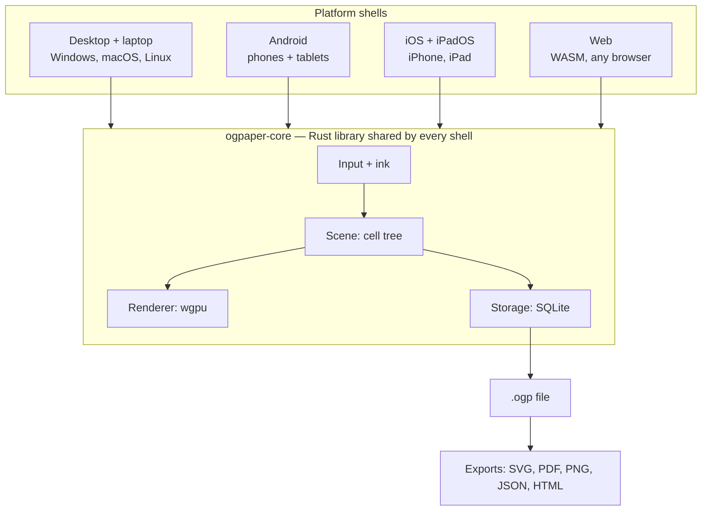

# OG Paper — Design Spec

Living version (with comments): https://claude.ai/code/artifact/8f7a907a-ec10-49dd-9fb0-4375907abd52
This file is the in-repo snapshot. Last synced 2026-09-26.

## Summary

Build an open-source infinite canvas that runs on every desktop, laptop, phone and tablet — Windows, macOS, Linux, Android, iOS/iPadOS and the web — and whose files outlive the app: every canvas is a documented, plain-format file a user can open with standard tools even if the project dies.

**What "endless" means here:** unbounded pan in 2D and unbounded zoom depth (not just 0.1x–10x). A user can write a sentence inside the dot of an "i" and zoom out until a whole notebook is a speck. The renderer only draws what is inside the viewport *and* big enough on screen to matter.

**Core promises:**

- **Files you own.** Local-first; no account needed; no server required to read your work.
- **Format outlives the app.** Open spec, versioned, SQLite + plain JSON/SVG export; any future tool can read it.
- **Runs everywhere.** One engine on six targets; the same file opens identically on a Windows laptop, an Android phone and an iPad.
- **Snappy on every supported device.** 2024 flagship phones are the performance bar; older devices are best-effort. Ink latency < 20 ms on native stylus hardware; 60 fps pan/zoom minimum, 120 Hz where the screen supports it.

**Non-goals for v1:** real-time multi-user collaboration, AI features, handwriting OCR, a project-hosted sync service.

## Endless Paper teardown

[Endless Paper](https://www.endlesspaper.app/) is an iPad-only, closed-source vector canvas from Epiphanie, built on a custom engine called **Fractile**; its only escape hatches are lossy exports (PNG, PDF, video, web page). There is no documented native file format, so a canvas cannot be re-opened anywhere else.

**Published features** ([App Store](https://apps.apple.com/us/app/endless-paper/id1294105620)):

| Area | What they ship |
| --- | --- |
| Canvas | Infinite pan + zoom; vector at any zoom; 120 fps "even with millions of strokes"; bookmarks |
| Ink | Apple Pencil pens, eraser modes, bucket fill, unlimited undo/redo |
| Organization | Up to 4 layers; lasso to move/resize/duplicate; multi-canvas gallery |
| Import | Images (drag-drop), PDF import + annotate, image vectorization |
| Export | Hi-res image, vector PDF, 8K zoom-animation video, "Web Experience" interactive site |
| Storage | Autosave with versioning/archiving; no open format documented |
| Platform | iPadOS 16+ only |
| Price | Free base; Premium $5.99/mo or $29.99/yr; Pro $99.99/yr |

**How the engine likely works (inferred, not published):** "Fractile" suggests fractal tiles — a quadtree where each level is a tile at 2× the zoom of its parent, strokes stored in tile-local coordinates. That is the standard way to beat float precision at deep zoom, and it matches their 2.1.6 note "improved stability for deeply zoomed canvases".

**Lock-in risks for users:** undocumented binary blob in the app sandbox; flattening exports; subscription-gated, iPad-only, one small company; if the app is pulled, a device wipe loses the ability to open the data.

**Open-source neighbors:** [Rnote](https://rnote.flxzt.net/) (Rust, stylus, bounded zoom, app-specific format), [Xournal++](https://xournalpp.github.io/) (page-based), [tldraw](https://tldraw.dev/) and [Excalidraw](https://excalidraw.com/) (web whiteboards, no deep zoom), Eagle Mode (infinite-zoom UI, not a notes app). None combine stylus-grade ink on every OS, unbounded zoom depth, and a durable open format — that gap is the project.

## Core architecture

One Rust core owns the scene, renderer and storage; each platform is a thin shell. Infinite zoom is solved with nested cells and exact integer cell addresses, not bigger floats.



### Why plain floats break

An f32 holds about 7 significant digits and an f64 about 16. A canvas with a zoom range past 10^7 jitters in f32; past 10^15 it jitters in f64. "Truly endless" needs coordinates with no global precision limit.

### Coordinate model: nested cells

- **World = sparse quadtree of cells.** A cell at level L has side 2^-L world units. L is any integer, unbounded both ways.
- **Cell address = (L, i, j)** with integer i, j. i64 while it fits; big integers past about 60 levels from the origin. Only cells that hold content exist.
- **Every object anchors to one cell:** the cell at the level where the object spans about 1/4 to 1 cell side. Its points are f32 in cell-local space [0, 1].
- **Camera = (cell, local offset, scale s in [1, 2))**. Zooming past 2× re-anchors the camera to a child or parent cell, so it never accumulates precision error.

Screen position of local point **p** in cell (L, **c**), camera in cell (Lc, **c_cam**) at offset **o_cam**:

```
x_screen = s · W · ( 2^(Lc − L) · (c + p) − c_cam − o_cam )
```

W is pixels per camera cell. The integer part, 2^(Lc−L) · c − c_cam, is computed exactly in integers first; it is small for anything on screen, so only a small number is converted to f64.

### What gets drawn each frame

1. Start at the camera cell. Walk up a few ancestor levels and down into descendants.
2. Cull any cell whose screen rectangle misses the viewport.
3. Stop descending when a cell is under about 1 px on screen; its content is never loaded.
4. Cells between about 1 and 256 px on screen draw a cached raster thumbnail (mip tile).
5. Larger cells draw vector meshes, tessellated once per LOD bucket and cached on the GPU. Huge ancestor strokes are clipped to the viewport.

Frame cost is O(visible), not O(canvas size). Cells load lazily from SQLite by address into an LRU cache.

### Ink pipeline

1. Pen events arrive batched + predicted from each OS: UIKit coalesced/predicted touches (iOS), MotionEvent history + front-buffered rendering (Android), Windows Ink, libinput tablet (Linux), NSEvent tablet (macOS), Pointer Events getCoalescedEvents/getPredictedEvents (web).
2. A 1€ filter smooths the path; pressure and tilt map to width and opacity.
3. Wet ink draws in a separate overlay at display refresh.
4. On pen-up, the stroke is fitted to a variable-width polyline, anchored to its cell, and committed as one op.

Stroke width is stored in cell-local units, so a note written at deep zoom stays proportionally tiny when zoomed out.

**Reference device and pen testing:** a Galaxy S24 is the reference phone and first Android test device. No stylus hardware yet, so pressure, tilt and prediction are built against recorded stroke traces replayed in tests; mouse and finger drive day-to-day development with simulated pressure; community testers tune real styluses.

### Fast on every device

| Tier | Example devices | Frame target | GPU cache | Quality |
| --- | --- | --- | --- | --- |
| High | iPad Pro, M-series Mac, discrete-GPU desktop | 120 fps+ | 512 MB+ | Vectors down to 128 px cells, 4× MSAA |
| Baseline (the bar) | 2024 flagship phones, iGPU laptops, recent tablets | 120 fps on 120 Hz, never below 60 | 256 MB | Thumbnails from 256 px down, 4× MSAA |
| Best-effort | Older/budget phones, Chromebooks, WebGL2-only | 60 fps aim | 128 MB | Thumbnails from 512 px down, shader AA |

Design targets to verify in Phase 0, not measured numbers.

1. **Ink never waits** — own overlay/front buffer, independent of scene, disk, sync.
2. **Render only on change** — no idle redraw loop.
3. **Frame governor** — over budget → raise thumbnail threshold; never drop input.
4. **Heavy work off the UI thread** — rayon natively, Web Workers in WASM.
5. **Fast gestures move pixels, not vectors** — re-tessellate after the gesture settles.
6. **Incremental saves** — one stroke = one SQLite insert in a WAL transaction.
7. **Instant open** — meta + cells near the last camera first, stream the rest.
8. **Hard memory caps** — tier-sized LRU; evict on OS low-memory warnings.
9. **Performance tests in CI** — 1M-stroke canvas, scripted zoom path, every target.

**Input by form factor:** stylus = draw, finger = pan/zoom on touch devices (palm rejection, optional finger-draw); wheel/pinch/space-drag and shortcuts on desktop. Toolbar: bottom bar on phones, floating palette on tablets, sidebar on desktop.

## Data model and file format

A canvas is one `.ogp` file: a SQLite database with a published, openly licensed schema. SQLite is a [Library of Congress recommended storage format](https://www.sqlite.org/locrsf.html) and its developers [intend to support it through 2050](https://www.sqlite.org/lts.html).

### Schema (v1 draft)

| Table | Key columns | Holds |
| --- | --- | --- |
| `meta` | key, value | `format_version`, `created`, `app_version`, plus a `README` row describing the format and the spec URL |
| `cells` | level, ix, iy | Cell address (ints as decimal text), bounding box, object count, cached thumbnail PNG |
| `objects` | id (UUIDv7) | Anchor cell, kind (`stroke`, `image`, `text`, `shape`, `pdf_page`), layer, z-order, transform, payload, timestamps, tombstone |
| `layers` | id | Name, order, visibility, lock |
| `bookmarks` | id | Name + camera (cell, offset, scale) |
| `blobs` | sha256 | Original image/PDF bytes + MIME type |
| `ops` | seq | Append-only edit log (JSON), each op stamped with a hybrid logical clock + device id |

**Stroke payload:** little-endian binary — header (point count, brush id, color RGBA, base width), then per point: x, y (u16, cell-local), pressure (u8), tilt (u8). About 6 bytes/point.

### Longevity guarantees

1. **Open spec, versioned** (CC BY 4.0). Minor versions only add; readers ignore unknown columns and kinds.
2. **Never drop unknown data** — older apps preserve newer object kinds untouched.
3. **Self-describing file** — the `meta.README` row explains the format.
4. **Stdlib-only reference reader** — `ogpaper-dump.py` (Python `sqlite3` + `struct`) turns any file into SVG + JSON.
5. **Plain-folder export** — `canvas.json`, one SVG per cell, original images.
6. **Self-contained HTML export** — one offline `.html` with the WASM viewer and data inlined.
7. **Standard flat exports** — SVG, vector PDF, PNG; zoom-path video later.
8. **Your storage, your sync** — files live wherever the user puts them; sync never needs a project server.

**Migrating off Endless Paper:** their vector PDF export → our PDF import. Depth and layers will not survive.

## Multi-device sync (v1)

Local-first: every device keeps a full `.ogp` file and exchanges small op-log segments merged by a simple CRDT. Syncing the live SQLite file itself through Dropbox/iCloud/Syncthing would corrupt it, so only append-only segments travel.

- **Clock:** hybrid logical clock + device id → one total order everywhere.
- **Objects:** add-wins set keyed by UUIDv7; deletes are tombstones.
- **Properties:** last-writer-wins per field.
- **Z-order:** fractional index strings.
- **Undo:** per device, emits inverse ops.
- **Blobs:** content-addressed by SHA-256.
- **Compaction:** prune segments once every device acknowledged a snapshot.

| Transport | How it works | Good for |
| --- | --- | --- |
| Sync folder (v1) | Each device writes `sync/<device-id>/<seq>.ops` into a folder synced by iCloud Drive, Google Drive, Dropbox, OneDrive, Syncthing or Nextcloud | Zero setup; minutes of delay |
| Self-hosted relay (v1) | `ogpaper-relay`, a small Rust server in one Docker container, store-and-forward over WebSocket | Near-real-time across a user's devices |
| LAN peer-to-peer (later) | mDNS discovery | No cloud at all |

Relay traffic is end-to-end encrypted (XChaCha20-Poly1305, key shared by QR code), so a relay operator sees only ciphertext.

### Free ways to run a relay

The project hosts nothing. The relay is written once in Rust. v1 ships the Docker image; a Cloudflare Worker build (workers-rs) follows in a point release.

| Option | Cost | Catches |
| --- | --- | --- |
| Sync folder (no relay) | Free with existing cloud storage | Not live |
| Home machine + Tailscale | Free: old laptop, Pi or NAS runs the Docker image | Machine must stay on |
| Own Cloudflare account (Worker + Durable Object) | Free plan: [100k requests/day, 100k SQLite rows written/day, 5 GB](https://developers.cloudflare.com/durable-objects/platform/pricing/) | Point release after v1; batch strokes per segment to stay far under limits |
| Oracle Cloud Always Free VM | [2 Arm OCPUs, 12 GB RAM, 10 TB/mo egress](https://docs.oracle.com/en-us/iaas/Content/FreeTier/freetier_topic-Always_Free_Resources.htm) | Idle instances may be reclaimed |

## Tech stack

| Layer | Choice |
| --- | --- |
| Core | Rust |
| GPU | wgpu (Metal, Vulkan, DX12, WebGPU/WebGL2, GLES) |
| Window + events | winit |
| Tool UI | egui on the same wgpu renderer |
| Pen glue | Small per-OS module behind one Rust trait |
| Mobile bridge | cargo-mobile2 + UniFFI |
| Geometry | lyon + custom variable-width stroke mesher |
| Storage | rusqlite (bundled); web: SQLite WASM + OPFS |
| Big integers | i64 fast path, num-bigint fallback |
| Text | cosmic-text |
| PDF | pdfium-render (import), krilla (export) |
| Distribution | winget/MSIX, DMG + Mac App Store, Flathub + AppImage, Play + F-Droid, App Store, web/PWA on GitHub Pages |

Hosted macOS CI runners build and sign Apple targets; everything else builds from Linux. CI matrix covers all six targets from day one.

## License

| Part | License |
| --- | --- |
| App code | MPL-2.0 (`/LICENSE`) |
| File-format spec | CC BY 4.0 (`/spec/LICENSE`) |
| `ogpaper-dump.py`, sample files | MIT |

MPL keeps changes to project files open (no closed fork recreating lock-in) and is App Store–compatible; GPL is not. Contributors use the DCO.

## Roadmap

Estimates assume one part-time developer: roughly 10–14 months to 1.0 on all six targets, sync included.

| Phase | Scope | Gate to pass |
| --- | --- | --- |
| 0 · Zoom spike (3–4 wk) | Cell tree, camera re-anchoring, synthetic strokes, wgpu renderer on Linux + Galaxy S24 | No jitter across 10^30× zoom; 120 fps with 1M strokes, on the phone too |
| 1 · Desktop MVP (6–8 wk) | Windows/macOS/Linux; ink, erasers, undo, `.ogp` autosave, SVG/PNG export, spec v1 draft, `ogpaper-dump.py` | 2 weeks of daily use; file fully recovered by `ogpaper-dump.py` alone |
| 2 · Android + web (6–8 wk) | Android phones/tablets, WASM web app, adaptive layout, HTML export | Same file identical on all targets; 120 fps on 2024 flagships |
| 3 · iPhone + iPad (4–6 wk) | UIKit pen glue, Pencil prediction, Files integration, TestFlight | < 20 ms pen-to-pixel; 120 fps pan/zoom on iPad Pro |
| 4 · Sync + v1 features (12–16 wk) | Sync folder + relay, lasso, images, layers, bookmarks, PDF, gallery, text + shapes | 1.0 release on all stores; spec 1.0 frozen |

## Open questions

- [x] File extension: `.ogp` (decided 2026-09-26).
- [x] Relay: Docker image in v1; Cloudflare Worker build in a point release.
- [x] Web app hosting: GitHub Pages from the repo.

No open questions right now; new ones go in [GitHub issues](https://github.com/OmegaGiven/OG-paper/issues).
